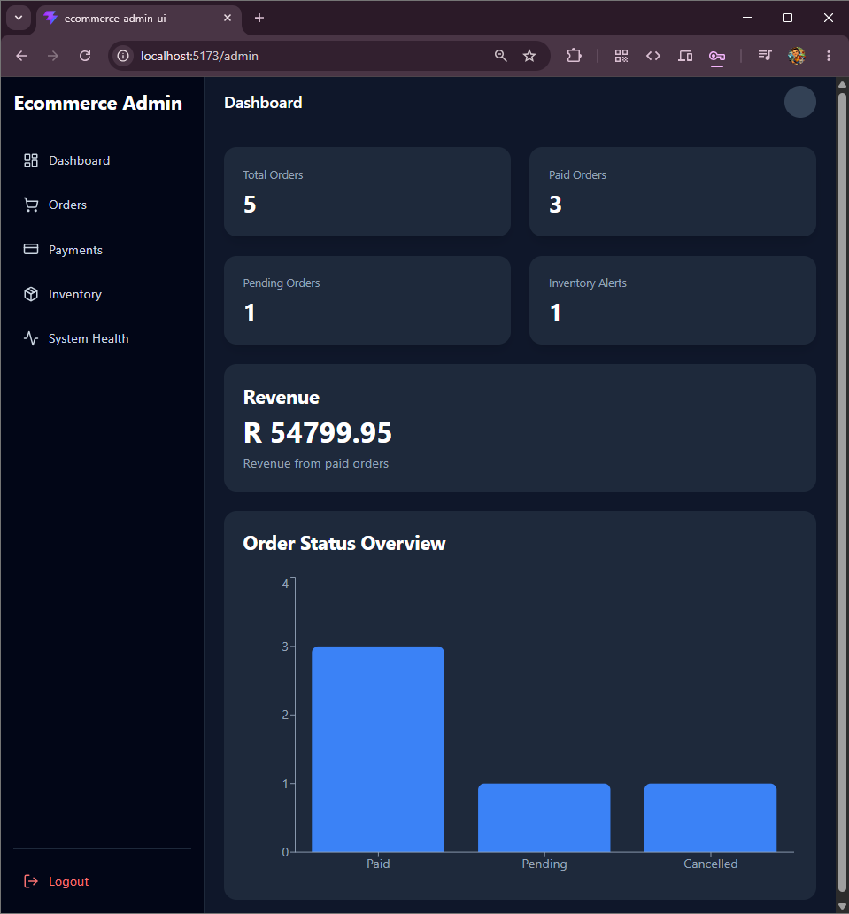
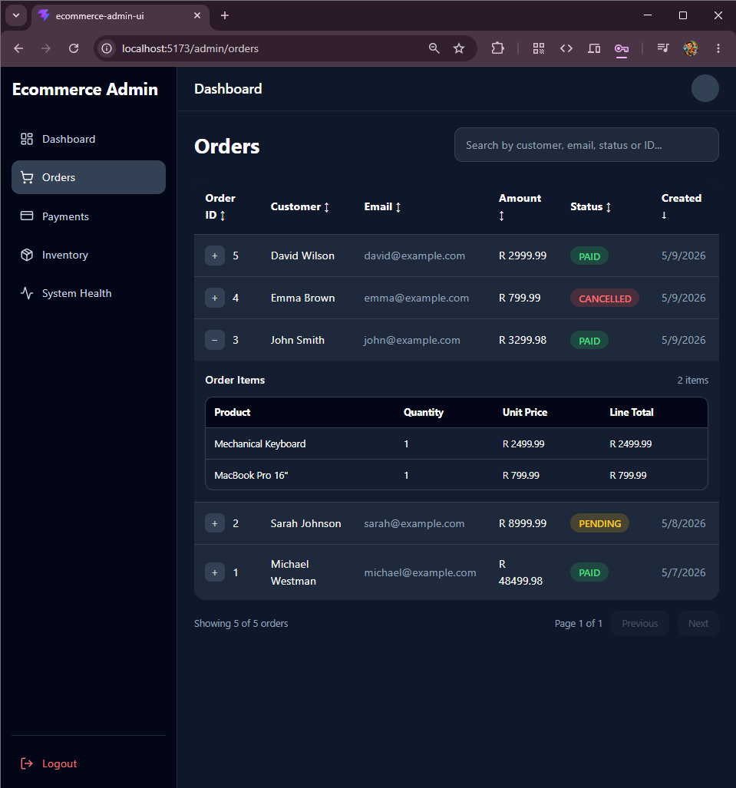
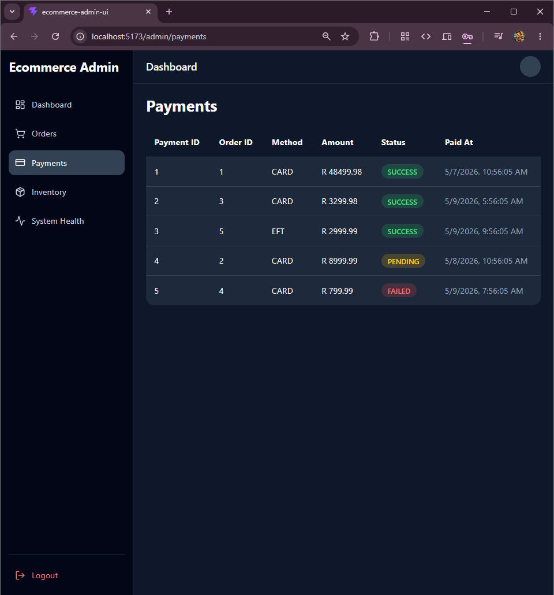
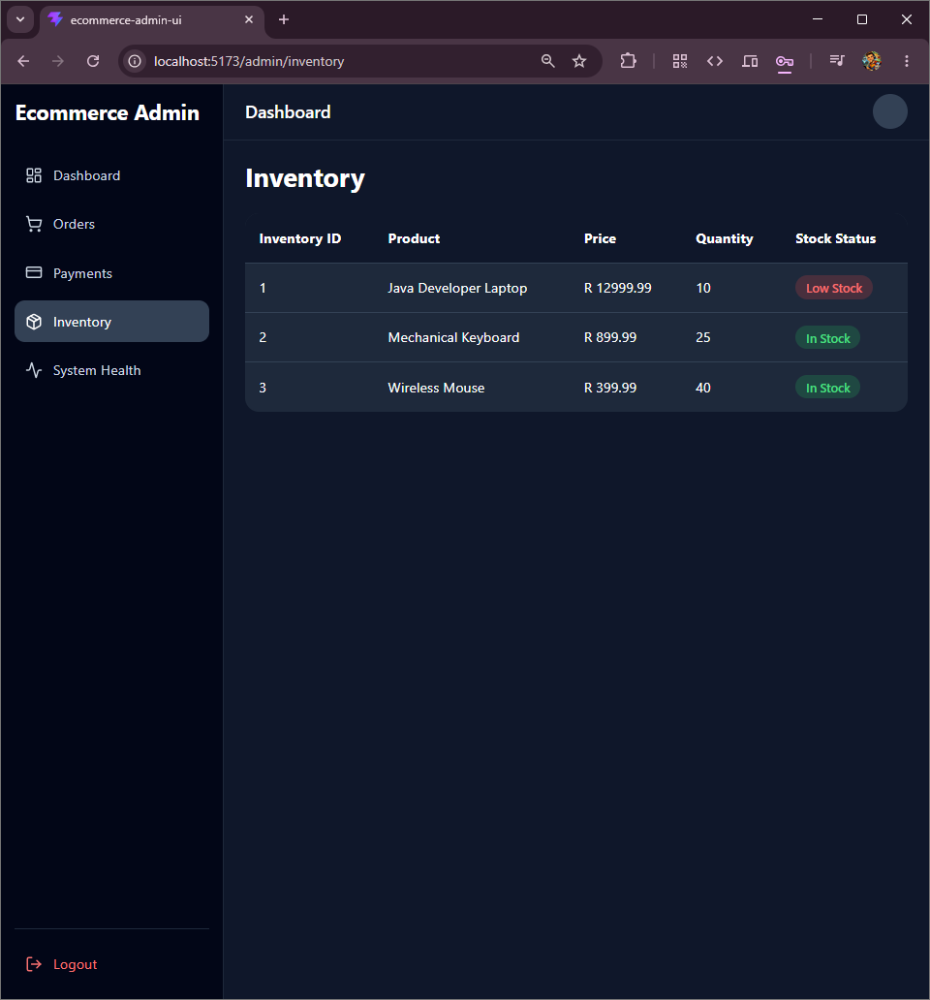
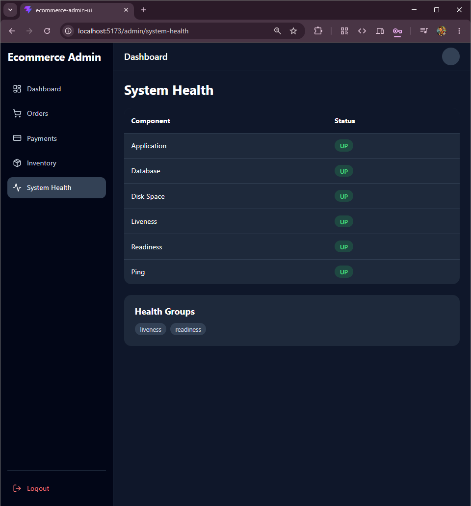

# 🖥️ Ecommerce Admin UI


## 📸 Application Screenshots

### 🔐 Login Screen


### 📊 Admin Dashboard


### 🛒 Orders Management


### 💳 Payments Monitoring


### 📦 Inventory Management


### ❤️ System Health Monitoring


Enterprise-grade React admin dashboard for the Ecommerce Platform ecosystem.

This frontend provides operational visibility and management capabilities for the Spring Boot backend, simulating a real-world operations portal used by support, engineering, and business teams.

Backend Repository:  
➡️ https://github.com/mikeywestie/ecommerce-api

---

## 🎯 Project Purpose

This project demonstrates:

- Secure JWT-based authentication
- Protected React routing
- Axios interceptors for token injection
- Operational dashboards and KPI visualizations
- Order, payment, and inventory management
- System health monitoring via Spring Boot Actuator
- Prometheus and Grafana integration
- Production-quality UI architecture

---

## 🚀 Current Release

**Latest Stable Release:** `v1.1.0 Observability Integration ✅`  
**Next Major Release:** `v1.2.0 Deployment & CI/CD 🚀`

---

## 🗂️ Release Milestones

The frontend was built iteratively, beginning with static mock data and evolving into a fully integrated operations dashboard.

### v1.0.0 Admin Dashboard Foundation ✅
- Login page
- JWT token storage
- Protected routes
- KPI widgets and charts
- Orders, Payments, Inventory, and System Health pages
- Responsive layout and sidebar navigation

### v1.1.0 Observability Integration ✅
- Prometheus metrics visibility
- Grafana dashboard integration
- Application health indicators

### v1.2.0 Deployment & CI/CD 🚀
Planned:
- Dockerized frontend
- Nginx production configuration
- GitHub Actions pipeline

---

## 🏗️ Architecture

```text
React + TypeScript + Vite
           │
           ▼
      Axios API Client
           │
           ▼
Spring Boot REST API
           │
 ┌─────────┼─────────┐
 ▼         ▼         ▼
JWT   PostgreSQL   Kafka
           │
           ▼
Spring Actuator
           │
           ▼
Prometheus
           │
           ▼
Grafana
```

---

## 💼 Portfolio Value

This project demonstrates that I can build polished, production-style frontend applications that integrate securely with enterprise backend services and expose meaningful operational insights.
